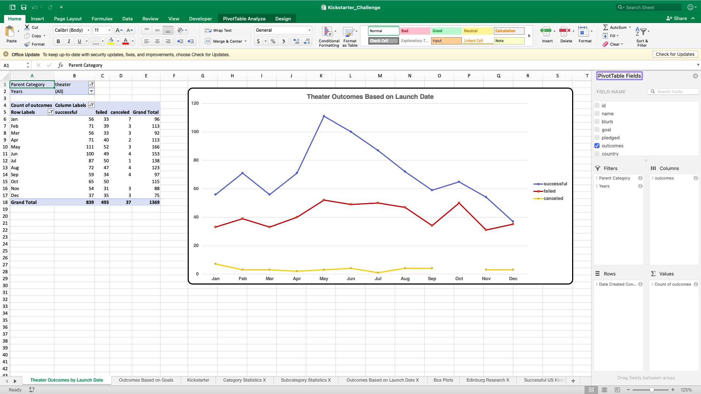
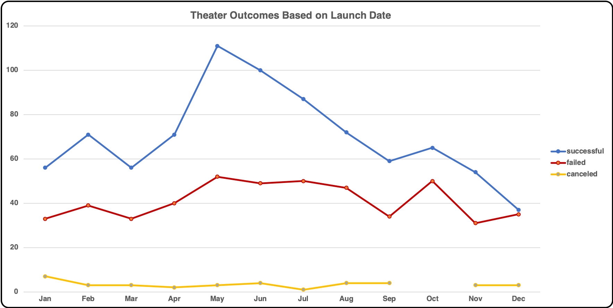
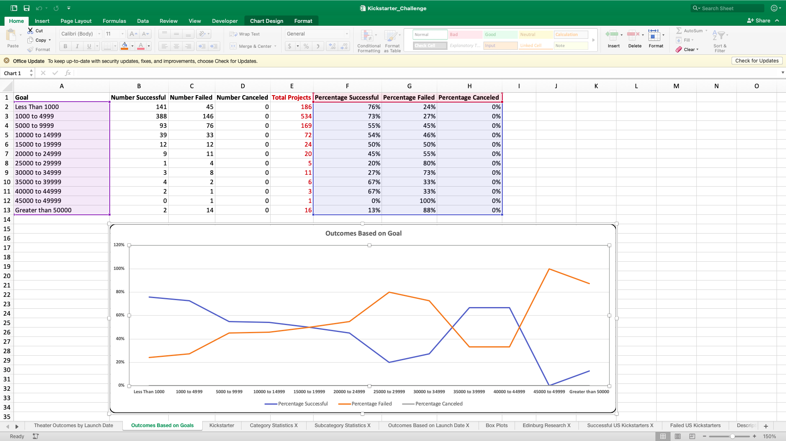
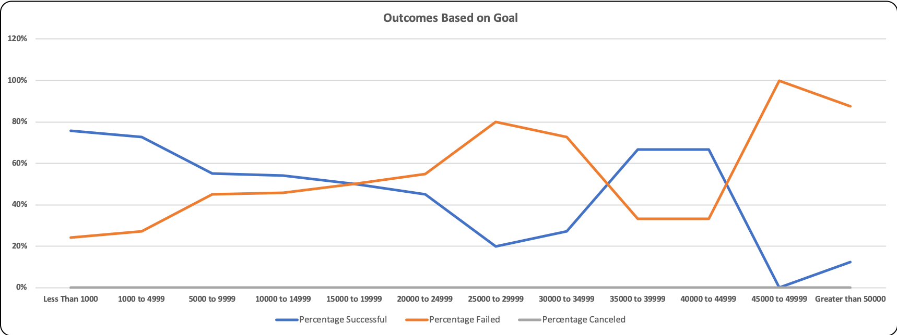

# **Module 1 Challenge: Kickstarter Analysis**

## **Overview of Project**

#### The purpose of this project is to help Louise to predict the best month(s) to launch future campaigns during the year and to set the appropriate campaign goals in order to achieve the highest successful outcomes.  In this project, we are focusing on the Theater category in general and the Plays subcategory in particular.

## **Analysis and Challenges**

### **Analysis of Outcomes Based on Launch Date**

#### The first analysis, using the Theater Outcomes by Launch Date worksheet, is to analyze the performance of different campaign categories over the years (2009 to 2017) by looking at their outcomes (Successful, Failed, and Cancelled) rates and trends during a 12 months period in order to predict on which month(s) a campaign is most and least successful or even failed and canceled throughout the year.  In this worksheet the analysis was focused on the Theater category.

#### This analysis was done by creating a pivot table and a corresponding pivot line chart.

#### The pivot table was created by adding:
#### •    Parent Category and Years to Filters
#### •    Outcomes to Columns
#### •    Date Created Conversions to Rows (Pivot table grouped the dates into months)
#### •    Count of Outcomes to Values

#### Then parent Category was filtered to “Theater” and Outcomes were sorted in descending order.  Then the pivot chart was created based on the pivot table.

 
        
 

### **Analysis of Outcomes Based on Goals**

#### The second analysis is to discover at the percentages of each outcome (in this case for subcategory Plays) based on goal amount ranges in order to see which Goal’s amount ranges are doing better or worse than the others.  In this worksheet we focus the analysis on the Plays subcategory.  This analysis was done by using the COUNTIFS() function to count the number of outcomes and group them into goal ranges if certain conditions were met based on the conditions of goal ranges, outcomes categories (successful, failed, or canceled), and subcategory type (in this case Plays) 

#### This is an example of the formula used:
#### =COUNTIFS(Kickstarter!$D:$D,"<1000",Kickstarter!$F:$F,"successful",Kickstarter!$R:$R,"plays")

#### Then percentages of each outcome category were calculated by the dividing the number of outcomes count from each category (successful, failed, or canceled) by the Total Projects (Total number of outcomes count).

#### The percentages were then used to create a line chart that showed the percentages of outcomes based on goal.

### **Challenges and Difficulties Encountered**

#### I did not encounter much challenges in creating the pivot table, pivot chart, writing the countif() function, and percentages chart.  One thing that raised a question when I was working on the countif() was the Goal range “Greater than 50000.”  I decided to set the condition as “>=50000” instead of “>50000” because otherwise we will be missing some outcome counts where the goal is equal to 50,000

#### =COUNTIFS(Kickstarter!$D:$D,">=50000",Kickstarter!$F:$F,"successful",Kickstarter!$R:$R,"plays")

#### I do encounter challenges in understanding instruction #2 (Analysis and Challenges) for this Deliverable 3.  To me it seems like the instruction asked me to explain step by step how I created the tables, charts, and formulas if I’m correct.  So, I tried to explain it as best as I could in the previous paragraphs. 

#### Also, I encountered the challenge of putting together this analysis into the README.md file.  I find it more complicated than just using MS Word.

## **Results**

### **The two conclusions from the Theater Outcomes by Launch Date**

#### •    Theater campaigns that were launched during the first half of the year have better successful outcomes compared to those during the second half the year.  The upward trend was starting in January with the peak happened around May and June.  While the failed trend movement was consistent with successful trend but the ups and downs are not as significant as the successful trend.  At the same time, the canceled trend was pretty much consistent throughout the year.

#### •    From this data it seems like it is better for Louise to launch the theater campaigns early in the year to reach higher successful outcomes.

### **Conclusion about the Outcomes based on Goals**

#### •    Most lower Goals Plays have higher successful outcomes and thus, higher goals have higher percentage of failure.  Except a few Plays within 35,000 to 44,999 range, which could be just anomalies.  So, it is recommended for Louise to plan her future Plays with lower budget and goals since those are the categories of Plays that have higher success percentage based on historical data.

### **Limitations of the dataset and recommended additional tables or graphs**

#### The Theater Outcomes by Launch date analysis was done using aggregated data from 2009 to 2017.  From 2009 to 2013 and 2017 there were very little data for Theater campaign outcomes and almost all the outcomes during those years were successful.  The bulk of the outcomes data came from 2014 to 2016 where we can see large numbers of various outcomes.  So, I think we should only look at data from 2014 to 2016 where we have enough data to look at the outcomes trend and we should also look at the data on a year to year basis instead of aggregating several years of data in order to get more accurate picture of how the campaigns were performing each year.

### **Other possible tables and/or graphs that we could create**

#### When I looked at each individual year (2014, 2015, and 2016), I could see similar upward trend for successful outcomes as the aggregated graph (2009 to 2017) where they peaked around mid of the year but there were more outcomes data fluctuations in the individual year’s graph. So, I would recommend additional individual line graphs for the Theater Outcomes by Launch Date for 2014, 2015, and 2016.
